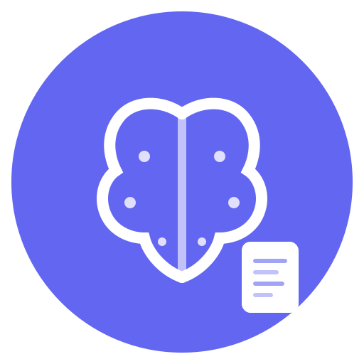

<p align="center">
  
</p>

<h1 align="center">NoteBrain</h1>

<p align="center">
  <strong>AI 驱动的个人知识管理系统</strong><br/>
  通过 MCP 协议让 Agent 帮你管理、检索、更新笔记文档
</p>

<p align="center">
  
  
  
  
  
  
</p>

---

## 核心功能

- **Markdown 文档管理** — 创建、编辑、组织你的笔记和文档
- **AI 对话助手** — 在 Web 端直接和 AI 对话，搜索知识库、整理资料
- **MCP 协议支持** — 在 Cursor / Claude Desktop 等工具中通过 Agent 操作文档
- **URL 内容抓取** — 给 AI 一个链接，自动抓取并整理为 Markdown 文档
- **笔记本 + 标签** — 灵活的文档组织方式
- **文档关联** — 建立文档间的引用、续写、相关等关系
- **版本历史** — 每次修改自动保存版本快照
- **长文档分段** — Agent 可以按行分页读取、按 Section 或精确文本替换

## 技术栈

| 层级 | 技术 |
|------|------|
| 前端 | Next.js 16 + React 19 + TypeScript + Tailwind CSS 4 + shadcn/ui |
| 后端 | Next.js Route Handlers（全栈一体） |
| 数据库 | PostgreSQL 17 + pgvector 0.8（向量搜索） |
| ORM | Prisma 7 |
| AI | Vercel AI SDK 6 + 任意 OpenAI 兼容 API |
| MCP | @modelcontextprotocol/sdk（独立 Node.js 进程） |
| 认证 | NextAuth.js + API Key（SHA-256 哈希） |

## 快速开始

### 前置条件

- Docker & Docker Compose
- Node.js >= 22（本地开发）

### Docker 部署（推荐）

```bash
# 1. 克隆项目
git clone https://github.com/vloum/notebook.git
cd notebook/notebrain

# 2. 配置环境变量
cp .env.example .env
# 编辑 .env，填入数据库密码、NextAuth 密钥、AI API Key

# 3. 启动数据库
docker compose up -d postgres

# 4. 运行迁移
docker compose run --rm --profile migration migrator

# 5. 启动全部服务
docker compose up -d

# 6. 访问 http://localhost:3000
```

### 本地开发

```bash
cd notebrain

# 安装依赖
npm install

# 配置 .env（需要一个 PostgreSQL 实例）
cp .env.example .env

# 数据库迁移
npx prisma migrate dev

# 启动开发服务器
npm run dev
```

## AI 模型配置

支持任意 OpenAI 兼容 API，通过环境变量配置：

```env
# OpenAI
AI_BASE_URL=https://api.openai.com/v1
AI_API_KEY=sk-xxx
AI_MODEL=gpt-4o-mini

# DeepSeek
AI_BASE_URL=https://api.deepseek.com/v1
AI_API_KEY=sk-xxx
AI_MODEL=deepseek-chat

# Ollama（本地）
AI_BASE_URL=http://localhost:11434/v1
AI_API_KEY=ollama
AI_MODEL=llama3

# 其他 OpenAI 兼容 API（Moonshot, Together, Groq 等）
AI_BASE_URL=https://api.example.com/v1
AI_API_KEY=your-key
AI_MODEL=model-name
```

## MCP 配置

1. 在 Web 端 **设置 → MCP API 密钥** 中生成密钥
2. 在 MCP Client（如 Cursor）中配置：

```json
{
  "mcpServers": {
    "notebrain": {
      "command": "npx",
      "args": ["-y", "notebrain-mcp"],
      "env": {
        "NOTEBRAIN_API_KEY": "nb_sk_your_key_here",
        "NOTEBRAIN_API_URL": "http://localhost:3000/api"
      }
    }
  }
}
```

### MCP 工具列表

| 工具 | 说明 |
|------|------|
| `entries_search` | 搜索文档（支持语义 + 元数据过滤） |
| `entry_get` | 读取文档（全文 / 大纲 / 分页） |
| `entry_get_section` | 读取文档某个 Section |
| `entry_create` | 创建文档 |
| `entry_update` | 更新文档 |
| `entry_append` | 追加内容 |
| `entry_update_section` | 更新某个 Section |
| `entry_replace` | 精确文本替换 |
| `entry_delete` | 删除文档 |
| `notebooks_list` | 列出笔记本 |
| `notebook_create` | 创建笔记本 |
| `tags_list` | 列出标签 |
| `entry_relations_list` | 查看文档关联 |
| `entry_relation_create` | 创建关联 |
| `fetch_url` | 抓取 URL 内容 |

## 项目结构

```
notebrain/
├── src/
│   ├── app/                 # Next.js App Router
│   │   ├── api/             # 后端 API
│   │   ├── (auth)/          # 登录 / 注册
│   │   └── (main)/          # 主应用页面
│   ├── components/          # React 组件
│   ├── lib/                 # 业务逻辑
│   │   ├── ai/              # AI 模型配置
│   │   ├── auth/            # 认证 + API Key
│   │   ├── markdown/        # MD 解析
│   │   └── services/        # 数据服务层
│   └── types/               # TypeScript 类型
├── mcp-server/              # MCP Server（独立进程）
├── prisma/                  # 数据库 Schema
├── docker/                  # Docker 配置
├── scripts/                 # 备份 / 恢复脚本
└── docs/                    # 设计文档
```

## 开发路线

- [x] **Phase 1** — 基础 CRUD + MCP + 前端页面 + AI Chat
- [ ] **Phase 2** — pgvector 向量检索 + 混合搜索（BM25 + 语义）
- [ ] **Phase 3** — 文档关联图谱 + 智能推荐
- [ ] **Phase 4** — 体验优化（版本对比、批量操作、关联可视化）

## 许可证

MIT

---

<p align="center">
  <sub>Built with Next.js, PostgreSQL, and AI SDK</sub>
</p>
